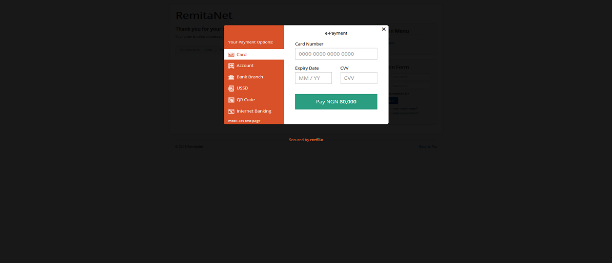
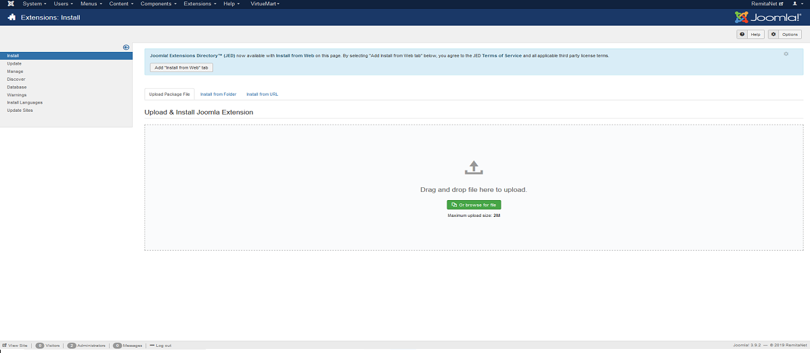
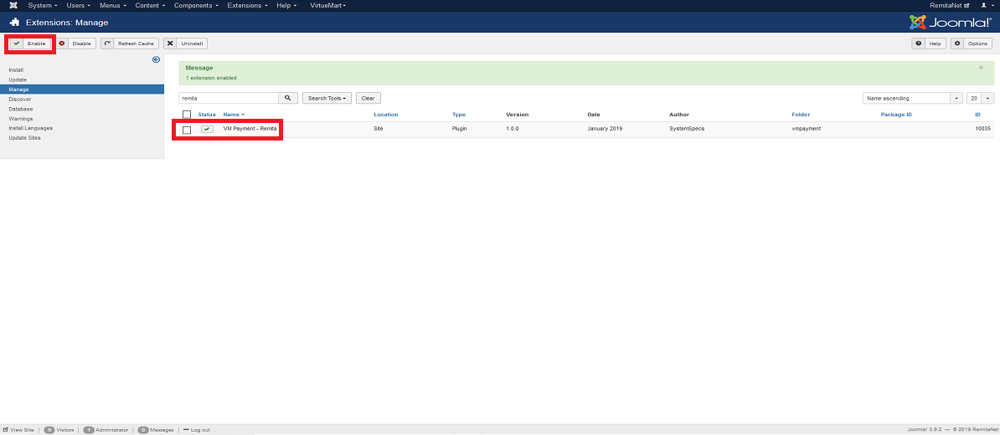
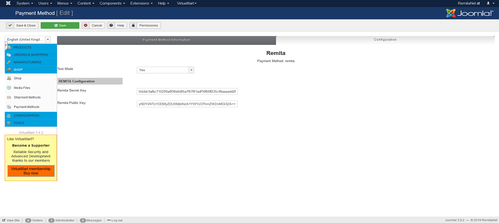
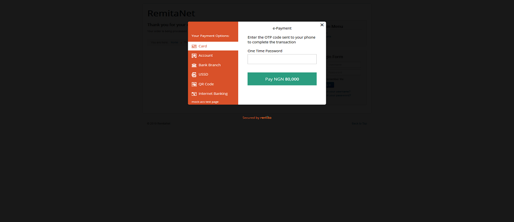
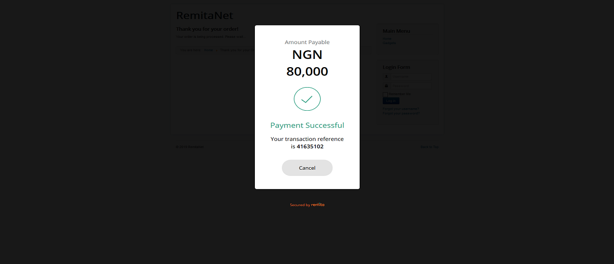

# Remita Joomla Virtuemart Payment Plugin


---
- [Summary](#summary)
- [Plugin Features](#Plugin Features)
- [Install](#Install)
- [Setup](#setup)
- [Others](#other-screenshots-from-remita-virtuemart-plugin)

---
### Summary

With Remita Joomla Virtuemart Payment Plugin, the store admin can easily add all desired payment methods to the Virtuemart webshop. Please refer to https://www.remita.net for an overview of all features and services.

 

---

### Plugin Features

*   __Accept payment__ via Visa Cards, Mastercards, Verve Cards and eWallets

* 	__Seamless integration__ into the Virtuemart checkout page.
* 	__Add Naira__ currency symbol.

---

### Install

```
Note that the Remita Virtuemart Payment Plugin cannot work without Virtuemart. Please ensure you have installed Virtuemart on your Joomla site before installing the Remita Virtuemart Payment Plugin. 
```


1. Clone or Download the Remita plugin zip file from remita github repository

2. Next, go to your Joomla Dashboard >> Extensions >> Manage >> Install. On the the tab on the Install page, select Upload Package File and upload the downloaded zip file. This would install and configure the plugin.


3. Type "remita" in the search bar, select VM Payment - Remita, and Enable it.



---

### Setup

1. To setup Remita, on your Joomla Settings, click on Components >> Virtuemart and select Payment Methods.
2. On the  Payment Method page, you'll see the available Payment methods on your Virtuemart Plugin. To add Remita, click on the New button at the top and fill the form that follows.
3. Below are the required fields and their corresponding details:



     
         * Payment Name: "Remita"
         * Set Alias: "remita"
         * Published: Set to Yes
         * Payment Description: This is the text that describes this Payment option to the user on checkout. You can enter "Pay with Remita"
         * Payment Method: Click on the dropdown, locate and choose VM Payment - Remita from the options.
         * Currency: Select Naira from the list in the dropdown
         
4. After that click on "Save" on the top of the page. When the page saves, click on the "Configuration". It will open the configuration page where you will be required to enter your API keys.


5. Enter the public key and secrete key (these can be found in the Remita Gateway Admin Panel --> https://www.remita.net/signin. Ensure to set Test Mode to No when you are ready to start receiving payments(go Live).
6. Click on "Save and Close"


### Other Screenshots from Remita Virtuemart Plugin





